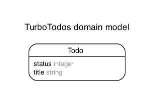

# App Name

# Features

# Model

Generated by Rails ERD. Run rails erd to regenerate (must have graphviz).

## Version

- ruby 3.2.2 (2023-03-30 revision e51014f9c0) [arm64-darwin23]
- Rails 7.1.3.2

## What I Learned

## References
